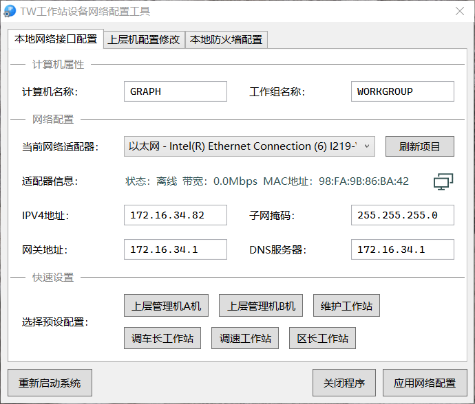
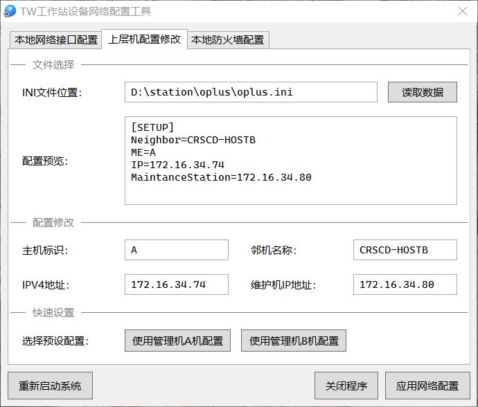
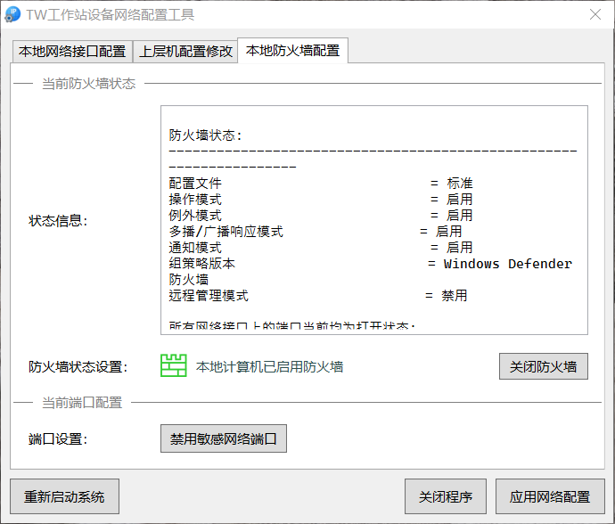


# TW系统工作站设备网络配置工具说明文档

## 软件说明

为优化TW系统中上层机及各个工作站计算机设备的网络配置流程，同时解决设备初始化、配置切换流程中设置复杂、容易出错的问题，特开发本工具。

本工具能够支持如下快速配置功能：

- 设置计算机名称（NetBIOS名称）以及网络工作组名称
- 查看本地计算机活动网络适配器列表及基本信息
- 设置网络适配器静态IP地址、子网掩码、网关地址以及DNS地址
- 使用预设配置文件快速设置上述信息
- 查看上层机设备配置文件
- 快速修改上层机网络配置
- 查看本地计算机防火墙状态
- 切换计算机防火墙启用状态
- 关闭本地计算机安全中心（取消防火墙、自动更新功能的报警提示）
- 在本地安全策略中设置敏感端口禁用功能

## 使用说明

本软件的使用过程需要使用人员具备以下基本工作能力：

- 操作键盘鼠标、阅读屏幕文本的能力
- 管理计算机文件、浏览软件使用文档的能力
- 基本的系统及网络安全常识

建议使用人员同时学习以下内容：

- Windows系统网络适配器设置流程
- 系统命令行工具与批处理的使用
- INI格式以及XML格式配置文档的编辑
- Windows组策略工具的常见配置方法
- 基于常见网络测试工具的调试方案

以下是几种典型工作的操作流程

### 修改工作站配置

1. 关闭其他所有无关程序，以管理员权限启动本工具
1. 查看计算机及网络信息（如果计算机有多网卡则选择需要修改的网卡设备）
1. 点击下方预设配置按钮（如<kbd>调车长工作站</kbd>按钮），点击后可看到页面上对应设置文本框已发生改变
1. 点击<kbd>应用网络配置</kbd>按钮，随后等待5秒左右，此时系统正在进行配置过程
1. 配置完成后弹出成功信息，此时点击<kbd>确认</kbd>按钮重启系统
1. 等待系统重启完成，进入系统后即可开始正常工作。



> 设置IP地址时可能会遇到存在相同IP地址设备而无法正确配置的问题，解决方案请参见下文。

### 上层机AB机配置切换

1. 关闭其他所有无关程序，以管理员权限启动本工具
1. 查看计算机及网络信息（如果计算机有多网卡则选择需要修改的网卡设备）
1. 点击下方预设配置按钮（如<kbd>上层机管理机A机</kbd>按钮），点击后可看到页面上对应设置文本框已发生改变
1. 点击程序上方<kbd>上层机配置修改</kbd>选项卡，查看当前计算机所使用的上层机网络配置文档
1. 如果配置文档不位于默认的文档目录，请修改文件路径重新读取配置
1. 点击程序下方的选择预设配置按钮（如<kbd>使用管理机A机配置</kbd>按钮），点击后可看到页面上对应设置文本框已发生改变
1. 点击<kbd>应用网络配置</kbd>按钮，随后等待5秒左右，此时系统正在进行配置过程
1. 配置完成后弹出成功信息，此时点击<kbd>确认</kbd>按钮重启系统
1. 等待系统重启完成，进入系统后即可开始正常工作。



### 关闭系统防火墙并阻止敏感端口访问

1. 关闭其他所有无关程序，以管理员权限启动本工具
1. 点击程序上方<kbd>本地防火墙配置</kbd>选项卡，查看当前计算机的防火墙状态
1. 点击<kbd>关闭防火墙</kbd>按钮，稍等片刻后可观察到当前防火墙操作状态已关闭
1. 点击<kbd>禁用敏感网络端口</kbd>按钮，稍等片刻后可看到成功信息提示
1. 关闭本工具即可



## 补充说明

### 程序配置修改

程序包含两个配置文档：

- `app.exe.config` 用于设置程序的某些功能项目或默认文本
- `preset.xml` 用于保存计算机名称以及IP设置的预设列表

### 批处理说明

程序附属的bat文件夹中包含常用的批处理文档（同时包含Windows XP所使用的ipseccmd程序）：

- `blockport_xp.bat` Windows XP系统快速清除、重置网络安全策略（阻止445端口入站网络访问）
- `blockport_win.bat` Windows 7系统快速清除、重置网络安全策略（阻止445端口入站网络访问）

### 网络调试方案

> 以下调试方案均使用命令行完成，Windows XP系统建议使用CMD程序，Windows 7及之后的操作系统建议使用Powershell

#### 基本信息查看

**查看计算机基本信息（包括计算机名称、网卡列表）：**

```sh
systeminfo
```

**查看计算机网络配置信息：**

```sh
ipconfig
```

#### 局域网通信测试

**测试某台计算机是否能正常访问：**

```sh
ping 172.16.34.1
```

**测试某台计算机某台端口是否可通信：**

```sh
telnet 172.16.34.1 445
```

> 以上网络通信测试建议使用局域网中的另外一台计算机完成，测试时注意IP及端口地址的合法性，Telnet功能须在控制面板的Windows功能管理中开启。

#### 防火墙以及网络安全策略查看

**查看当前计算机防火墙信息：**

```sh
netsh firewall show state
```

**查看当前计算机所有网络安全策略信息（与端口封锁相关）：**

```sh
# Windows XP
ipseccmd show filters

# Windows 7
netsh ipset static show all
```

### 关闭安全中心

Windows系统使用安全中心服务对系统防火墙状态、自动更新状态、防病毒软件状态进行监视，并在系统处于不安全状态时使用通知气泡进行提醒。建议在正常使用计算机时不要关闭安全中心。在本工具中可使用按钮一键关闭该服务并阻止其在系统重启时自动启动，启动后用户将不会看到系统的不安全报警信息。

如果在关闭后需要重新启用，可进行如下操作：

1. 运行`services.msc`命令，启动系统服务管理窗口（需使用管理员权限）
2. 在服务列表中寻找Security Center项目，双击打开属性窗口
3. 设置启动类型为**自动**并应用，然后点击<kbd>启动</kbd>按钮启动服务
4. 点击<kbd>确认</kbd>按钮应用设置，然后关闭窗口即可。

或者使用命令行程序直接开启安全中心服务：

```sh
sc config wscsvc start= auto & sc start wscsvc
```

## 注意事项

- **修改网络设置、系统组策略、防火墙状态均属于关键性系统操作行为，进行非法修改可能导致严重工作故障，请在配置过程中严格按照操作说明进行工作，并注意各个设置项目的合法性；**
- 本程序须使用管理员账户运行，使用时请注意系统UAC设置以及病毒注入防护（建议使用已签名的程序）；
- 对于计算机名称、工作组名称的修改需要重启系统完成，请在使用本工具时关闭其他工作程序并在配置完成后及时重启计算机；
- 更改网络适配器静态IP地址时系统可能会提示局域网中已存在相同IP地址的设备，此时应当从局域网中断开该网络适配器重新进行设置（或尝试使用不同的IP地址），建议在配置多台计算机时先离线配置然后接入局域网进行测试；
- 计算机重启后若无法进入工作状态，请尝试使用安全模式、使用VGA模式、使用上一次正确的配置重启计算机（重启计算机时按下<kbd>F12</kbd>或<kbd>F8</kbd>），如无法解决请尝试还原系统；
- 计算机之间传输文件时尽量采用安全方式（串口、TFTP协议、NFS服务等），减少不安全的网络共享方式；
- 如果在使用本工具中出现程序异常、工作错误报警，请及时记录错误信息并与开发和维护人员联系。